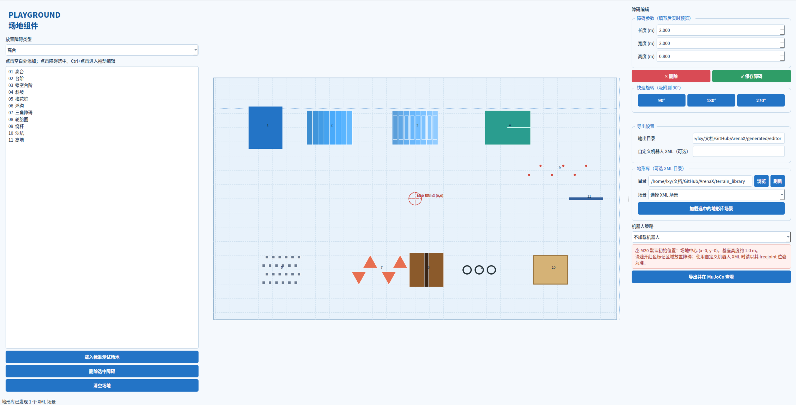
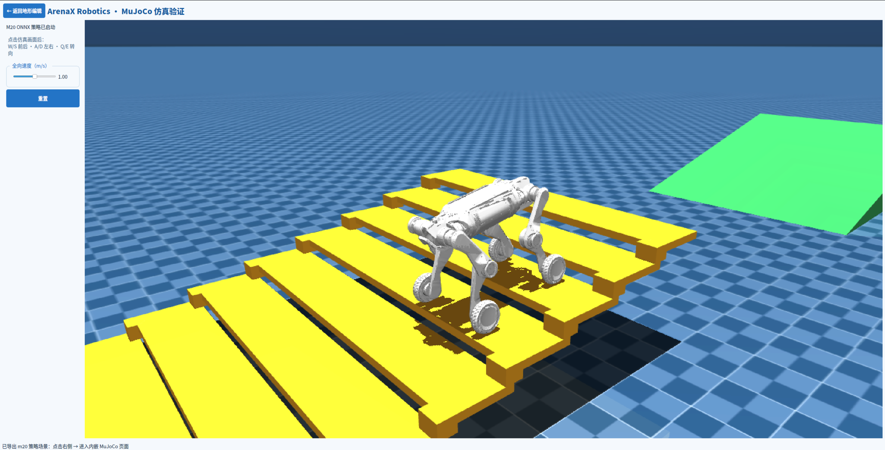
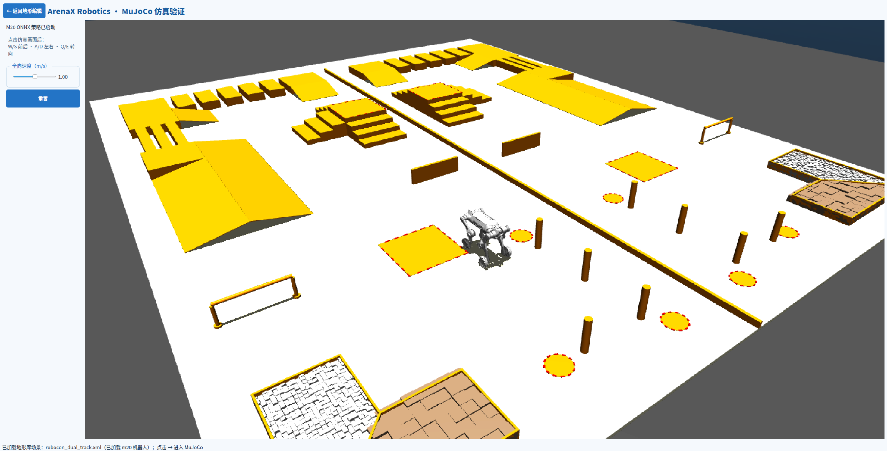

# ArenaX Robotics

[English](README_en.md)

Robot Terrain & Policy Validation Environment

一个面向机器人策略验证的 MuJoCo 地形与场景工具。

## 界面与仿真示例

场地编辑器提供俯视布局、障碍参数编辑和地形库加载：



导出场景后，可以在内嵌 MuJoCo 页面中运行 M20 策略并观察机器人通过障碍：



也可以直接加载地形库中的完整 XML 场景进行验证：



支持生成：

- MuJoCo XML 场景文件
- MuJoCo 可读取的 PNG 高度图
- 描述生成参数的 JSON 元数据

当前内置基础地形类型：`flat`、`slope`、`stairs`、`noise`、`obstacle_mix`。

机器人 play 测试障碍组件：高台、鸿沟、台阶、镂空台阶、斜坡、独立小方柱梅花桩、三角障碍、平放汽车轮胎圈、绕杆、沙坑、高墙。高台默认高度 `0.8 m`，梅花桩默认边长 `0.2 m`；鸿沟由两侧截断等腰梯形斜坡组成，中间间隙 `0.3 m`、高度 `0.3 m`，并可调上底、下底和长度。三角障碍默认采用约 `30°` 坡度，按左、右、左、右交错，并带有通过方向错位参数 `stagger=0.8m`，避免左右障碍面对面；每两个障碍按 `pair_yaw=90°` 旋转。

默认尺寸约定：轮胎圈外径 `0.74 m`、梅花桩边长 `0.2 m`；这些尺寸都可以在 PyQt 编辑器右侧障碍参数中修改。
沙坑默认表面高度为 `0.06 m`，并带有可调的曲面起伏、坑洼和碎石参数；这些参数同样可以在编辑器中调整。

## 快速开始

建议使用项目自己的 `.venv` 环境：

Linux/macOS 可以使用仓库根目录的一键脚本自动创建虚拟环境并安装依赖：

```bash
./install.sh --run
```

不启动编辑器、只完成安装时运行 `./install.sh`。Windows PowerShell 对应运行：

```powershell
Set-ExecutionPolicy -Scope Process Bypass
.\install.ps1 -Run
```

脚本使用 `uv` 管理项目内的 `.venv`，缺少 `uv` 时会通过官方安装脚本自动安装；如果本机没有对应的 Python 版本，`uv` 也会自动下载。也可以指定 Python 版本：

```bash
./install.sh --python 3.12
```

```bash
python3 -m terrain_generator.cli \
  --type noise \
  --output generated/noise \
  --seed 7 \
  --rows 128 \
  --cols 128 \
  --length 8 \
  --width 8 \
  --height 0.8
```

输出目录中会有：

```text
generated/noise/
├── terrain.xml
├── terrain.png
└── terrain.json
```

验证 XML 是否可以被 MuJoCo 编译：

```bash
python3 -m terrain_generator.cli \
  --type stairs \
  --output generated/stairs \
  --validate
```

生成后直接打开交互式可视化窗口：

```bash
python3 -m terrain_generator.cli \
  --type noise \
  --output generated/noise \
  --seed 7 \
  --view
```

窗口打开后可以用鼠标旋转、缩放和移动视角；关闭窗口即可结束程序。`--validate --view` 可以同时编译检查并打开窗口。

一键生成包含全部常用障碍的标准测试场地：

标准预设场地尺寸为约 `28.3 × 17.0 m`（面积约为旧版本的 2 倍），障碍已重新分区
排布，减少相互遮挡和机器人行走干涉。
标准预设只包含一个默认高台。旧版 M20 基础场景中遗留的 `box25`–`box55` 演示箱体会在导出时移除，避免与编辑器中手动放置的高台重复；手动放置的高台数量不受限制。

```bash
python3 -m terrain_generator.cli \
  --preset playground \
  --output generated/playground \
  --validate \
  --view
```

如果已有宇树机器人场景（例如包含 `go2.xml` 的 `scene.xml`），可以直接在其基础上追加障碍：

```bash
python3 -m terrain_generator.cli \
  --preset playground \
  --base-scene /path/to/unitree_mujoco/terrain_tool/scene.xml \
  --output generated/go2_playground \
  --validate \
  --view \
  --no-test-ball
```

导出的 XML 会保留基础场景中的机器人、asset 和 worldbody 内容；对带有网格资源的机器人 include 会自动展开，并把资源路径转换为可加载的路径。

## 蓝白色 PyQt 图形化编辑器

编辑器使用蓝白色界面，所有操作都以障碍对象为中心：左侧选择新增障碍类型和对象列表，中间是场地俯视预览，右侧编辑当前障碍的参数。点击空白处按当前类型新增，点击障碍即可选中；按住 Ctrl 点击障碍进入单对象编辑，可直接拖动障碍改变位置，使用右侧旋转按钮改变朝向，最后点击“保存障碍”或“删除”。

```bash
arenax \
  --edit \
  --output generated/my_arena
```

启动英文界面：`arenax --edit --language en --output generated/my_arena`。中文仍为默认界面。
启动后也可以点击左侧的 **English** 按钮，在中文和英文之间即时切换；仿真页面右上角同样提供语言按钮。

命令行入口使用 `arenax`。

编辑器右侧提供一个导出操作、一个机器人选项和一个页面跳转箭头：

- **添加 M20 机器人并运行策略**：勾选后，导出时自动使用仓库内置 M20 和 `policies/m20/policy.onnx`。

- **M20 / Go2 单机器人切换**：M20 和 Go2 使用各自独立的 MuJoCo 场景、资产、策略和配置。Go2 的 `go2_amp_dreamwaq` 第 20000 步检查点保存在 `policies/go2/checkpoints/model_20000.pt`，转换后的唯一部署策略保存在 `policies/go2/policy.onnx`。

  ```bash
  .venv/bin/python -c "import mujoco; m=mujoco.MjModel.from_xml_path('assets/go2/mjcf/scene.xml'); print(m.nbody, m.njnt, m.nu)"
  ```

  ArenaX Robotics 控制器按所选机器人加载对应 ONNX 策略。`model_20000.pt` 作为 Go2 训练检查点保留，部署时只使用 `policies/go2/policy.onnx`。

  命令行可在 M20 与 Go2 之间切换：

  ```bash
  arenax --robot m20 --policy policies/m20/policy.onnx
  arenax --robot go2 --policy policies/go2/policy.onnx
  ```

  M20 与 Go2 使用独立的三层资源，不会共享关节顺序或控制参数：
  `assets/<robot>/mjcf/`（模型资产）→ `policies/<robot>/`（策略）→ `configs/<robot>.yaml`（观测、PD 与关节映射）。Go2 的 FR/RL/RR 默认姿态已与训练部署脚本一致，避免启动时向一侧倾斜。
- **导出并在 MuJoCo 查看**：导出完成后点击右侧 `→`，进入同一个 PyQt 应用的第二页。第二页左侧仅保留速度和手动重置，右侧是通过 MuJoCo `Renderer` 内嵌的轻量化渲染画面；勾选机器人选项时同时运行 M20 ONNX 策略。

编辑器预览中的红色圆形标记是内置 M20 的默认出生区域（世界坐标 `x=0, y=0`，
基座高度约 `1.0 m`）。放置障碍时应避开该区域；自定义机器人 XML 的出生位姿可能不同。

每次点击都会在输出目录下新建本地时间命名的子目录，例如 `generated/my_arena/output_20260901_153045/`；如果同一秒重复导出，会自动追加序号，不会覆盖已有结果。

内嵌模式不再启动独立的 MuJoCo viewer 或控制面板进程，避免 GLFW 键盘快捷键和 Qt 插件冲突。

如需使用旧的独立控制面板入口，现在也支持两种机器人。通过 `--robot` 选择对应的配置和策略：

```bash
python3 -m terrain_generator.simulation.control_panel \
  --robot m20 \
  --xml generated/m20_playground/terrain.xml \
  --policy policies/m20/policy.onnx

python3 -m terrain_generator.simulation.control_panel \
  --robot go2 \
  --xml generated/go2_arena/terrain.xml \
  --policy policies/go2/policy.onnx
```

仿真页画布以 1280×720（720p）渲染，使用 30 FPS 显示并在后台批量补齐物理步，
避免渲染阻塞策略推理。选中画布后，鼠标滚轮缩放、左键拖动旋转、右键拖动平移；
`W/S` 前后、`A/D` 左右平移、`Q/E` 左右转向。鼠标拖动方向与场景移动方向一致；
左侧“全向速度”滑块可在 0–2 m/s
调整（默认 1 m/s）。
机器人碰撞代理仍参与物理接触，但在内嵌页和独立 viewer 中默认隐藏，仅显示机器人外观网格。

## 地形库（可选扩展）

可以把独立的 MuJoCo XML 文件直接放进一个目录，在编辑器右侧“地形库”中刷新并加载，
或通过命令行选择：

项目已预留默认目录 `terrain_library/`（位于仓库根目录）。把单个或多个 `.xml` 文件
直接复制到该目录，打开编辑器后会自动发现（也可以点击“刷新”）；也可以在编辑器中浏览到其他目录。

```bash
arenax --terrain-library /path/to/terrain_library --terrain-name rocky --view
```

省略 `--terrain-name` 时读取目录中按文件名排序的第一个 XML。地形库场景按原 XML
直接加载，不会经过程序化地形生成，也不会影响主线导出流程。点击编辑器中的“加载选中的地形库场景”前会弹出覆盖提示；确认后本次仿真入口切换为该 XML，未导出的地形编辑内容不会自动保留。
如果同时勾选“添加 M20 机器人并运行策略”，导入时会自动生成一个临时的 M20+地形库合并场景，再进入内嵌仿真页面。
合并场景只保留地形库 XML 自带的地面，不再叠加 M20 模板地面；若地形库使用
`compiler angle="degree"` 而 M20 使用弧度制，导入时会自动转换地形元素的 `euler`
旋转值，避免斜坡方向或倾角异常。

项目代码边界为：`terrain_generator/terrain/` 负责地形数据模型、程序化生成、
场景组合和 XML 导出；`terrain_generator/simulation/` 负责机器人策略、MuJoCo
渲染、交互和控制面板；`terrain_generator/terrain/library.py` 负责可选的外部 XML 场景发现与加载。

### 地面闪烁（Z-fighting）

如果基础机器人 XML 自带 `worldbody` 平面地面，而导出器又添加了从 `z=0`
开始的高度场，两张表面会重合，深度缓冲无法稳定选择其中一张，表现为闪烁。
默认 `flat` 场景直接使用 MuJoCo 平面地面，不再额外添加高度场几何体；只有
`slope`、`stairs`、`noise`、`obstacle_mix` 等需要起伏的地形才会移除基础平面并使用唯一的高度场。

## ONNX 策略与机器人验证

ArenaX Robotics 当前接入 M20 的 DreamWaQ ONNX 推理运行时。M20 的 MJCF、STL 网格和 ONNX 策略均已放入本仓库的 `assets/m20/` 和 `policies/m20/`，不再依赖下载目录。也可以通过命令行传入其他策略或机器人 XML。

使用仓库内置的 DreamWaQ M20 模型和策略（未指定 `--base-scene` 时会自动使用内置模型）：

```bash
arenax \
  --preset playground \
  --output generated/m20_playground \
  --policy policies/m20/policy.onnx
```

也可以直接运行已经导出的 XML：

```bash
arenax \
  --xml generated/m20_playground/terrain.xml \
  --policy /path/to/policy.onnx
```

内嵌机器人运行时点击 MuJoCo 画面后直接使用 `W/A/S/D/Q/E` 控制；左侧只保留全向速度滑块和手动重置。直接使用 `arenax --policy` 时仍可使用方向键或数字小键盘控制。

运行时会校验 ONNX 输入维度。目前 M20 DreamWaQ 配置为 `57` 维观测、`5` 帧历史，即 `342` 维策略输入，动作维度为 `16`。

编辑器会导出 `terrain.xml`、`terrain.png`、`terrain.json` 和 `scene.json`。如果需要直接加载宇树机器人场景，可以这样启动：

```bash
python3 -m terrain_generator.cli \
  --edit \
  --base-scene /path/to/unitree_mujoco/terrain_tool/scene.xml \
  --output generated/go2_arena
```

点击“导出并在 MuJoCo 查看”可以在导出后自动打开三维仿真窗口。以后也可以直接回读并可视化场景（将路径替换为实际生成的时间目录）：

```bash
python3 -m terrain_generator.cli \
  --scene generated/my_arena/output_20260901_153045/scene.json \
  --output generated/my_arena/reexport \
  --validate \
  --view
```

在 Python 中使用：

```python
from terrain_generator import TerrainConfig, generate_terrain, export_mujoco

config = TerrainConfig(kind="obstacle_mix", seed=42, rows=128, cols=128)
terrain = generate_terrain(config)
export_mujoco(terrain, "generated/obstacle_mix")
```

## 设计说明

非平面地形表面使用 MuJoCo 的 `hfield` geom 表示，因此场景中只需要一个地形 geom，仿真效率比生成大量 box geom 更好。默认平面场景使用 MuJoCo `plane`；`obstacle_mix` 会把箱型障碍物直接写入 XML，并保留同一张高度图作为基础地面。

地形的物理尺寸由 `length`、`width`、`height` 控制；`rows` 和 `cols` 控制高度图采样分辨率。所有随机地形均支持 `seed`，相同参数会得到可复现结果。

## 后续扩展方向

- 增加 Perlin/Simplex 噪声和侵蚀模拟
- 支持编辑器中的障碍尺寸、朝向和参数面板
- 增加机器人 spawn pose、路线和碰撞测试配置
- 输出 PNG/OBJ/PLY 以及批量场景配置
- 接入 Gymnasium / dm_control 环境
